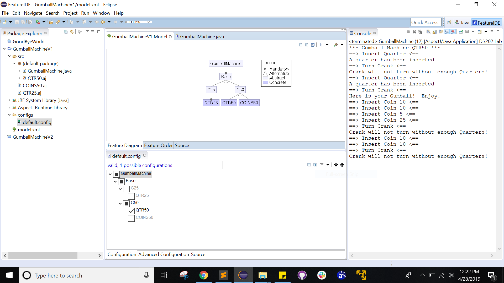
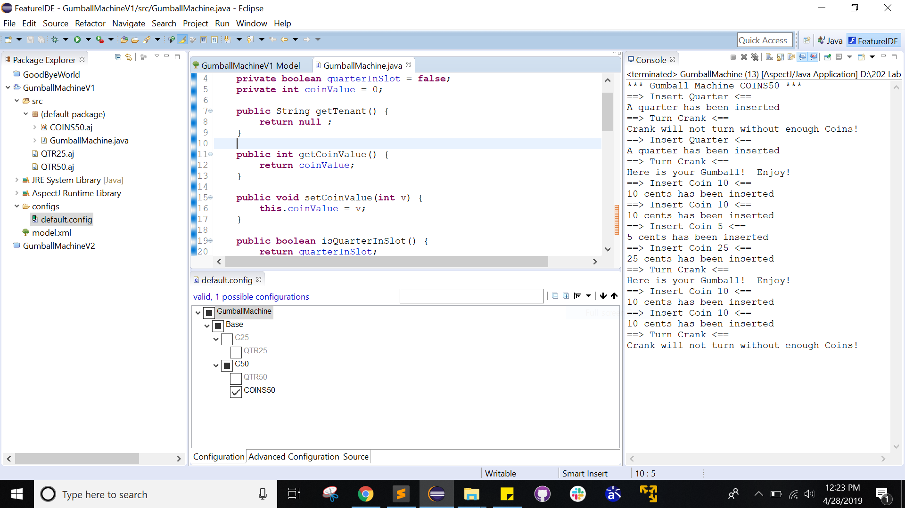
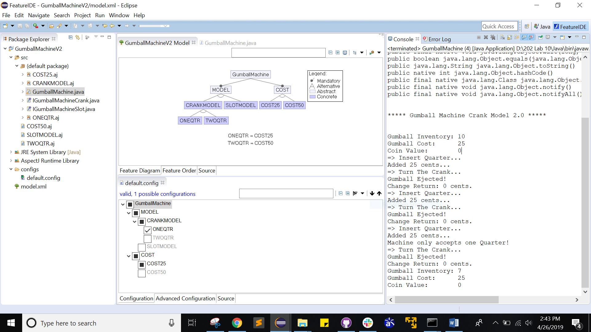
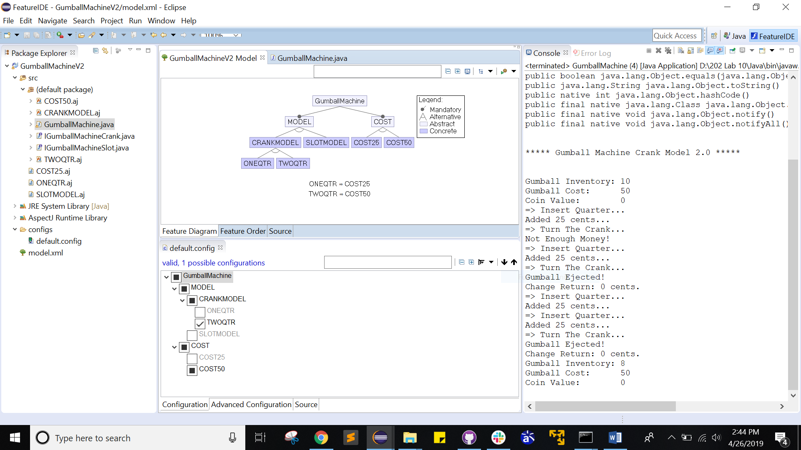
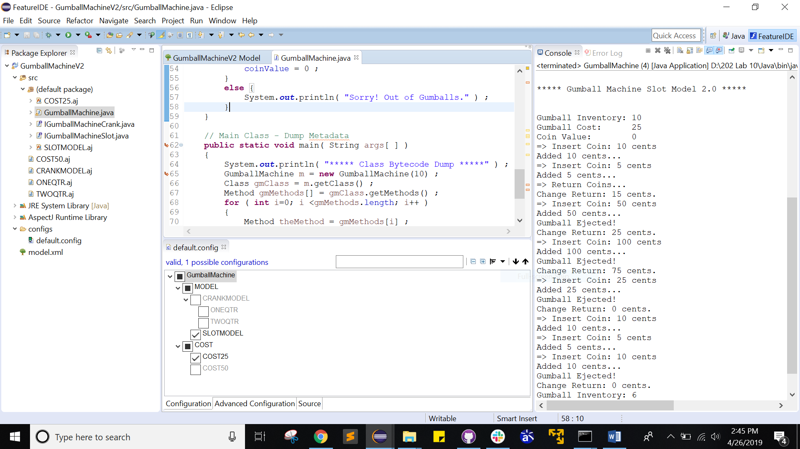
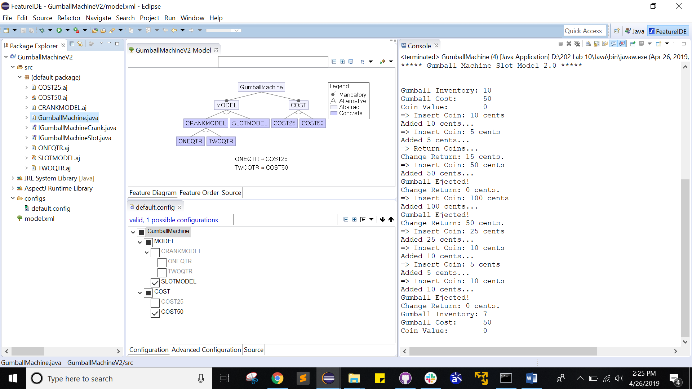
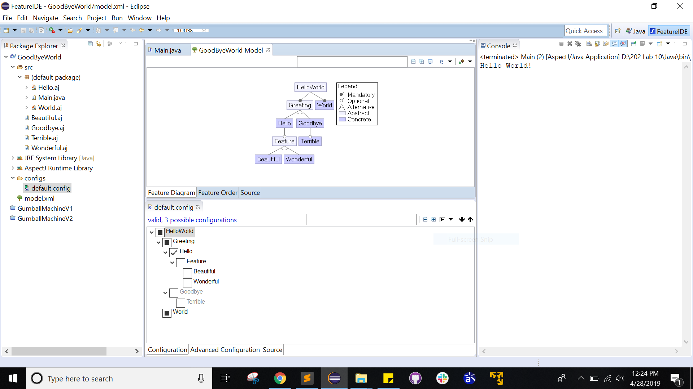

# Lab #10 

## Comparison between the 2 implementations - 
- AspectJ has made the code much more manageable and modularized than the code in Lab #1

- Behavior can be easily changed at compile time using Feature IDE and Aspect programming by modifying the config file.
  without any code changes

- Code debugging is much easier in the ApsectJ implementation

--------------------------------------------------------------------------------------------

Code Execution using Feature IDE v3.0.0 in Eclipse 4.5.2 Mars using Java 8 SDK. 

## Screenshots - 
--------------------------------------------------------------------------------------------

### Gumball Machine V1
--------------------------------------------------------------------------------------------

1. Quarter Machine - 25 cents  

2. Quarter Machine - 50 cents

3. Coins Machine - 50 cents

### Gumball Machine V2
--------------------------------------------------------------------------------------------

1. Crank Machine - 25 cents

2. Crank Machine - 50 cents

3. Slot Machine - 25 cents

4. Slot Machine - 50 cents

### GoodbyeWorld
--------------------------------------------------------------------------------------------

1. Hello World

